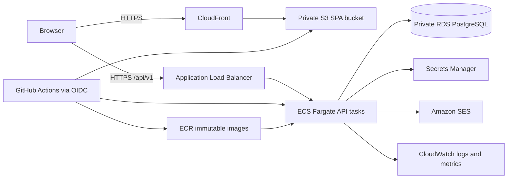
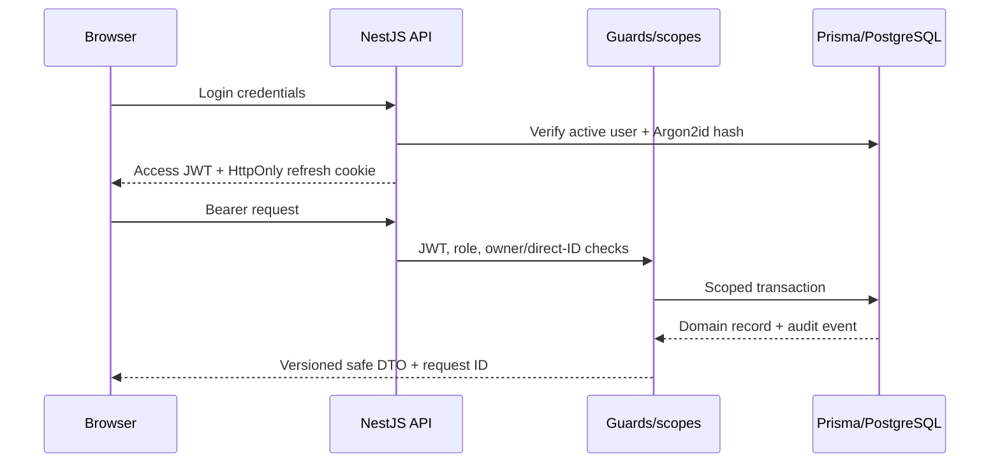
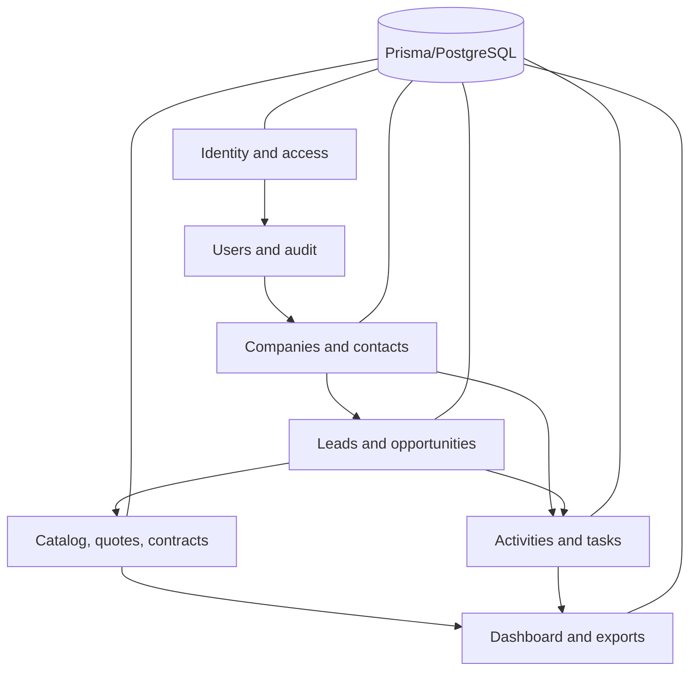

# Architecture

## Deployment view

The ALB and CloudFront are public. ECS and RDS run in private subnets across at least two availability zones. RDS accepts PostgreSQL only from the API security group. The frontend bucket blocks public access and is readable only through CloudFront OAC.

## Request and authorization flow

Access tokens remain in memory. The refresh cookie is opaque; only a peppered SHA-256 hash is stored. Rotation and replay-family revocation use serializable transactions. Protected APIs combine authentication, role metadata, and owner predicates; nested resources are checked through their parent.

## Module boundaries

Nest modules own DTO validation, business services, controllers, and audit production. React pages consume versioned REST endpoints through TanStack Query. Shared contracts contain cross-package response types; Prisma types never cross the API boundary intentionally.

## Data integrity

The schema uses UUID primary keys, explicit foreign keys, Decimal monetary values, timestamptz event fields, date-only commercial dates, soft deletion for customer/business records, immutable audit rows, stage history, quote snapshots, unique quote versions, and checked status/rate/value constraints. The initial migration adds GIN search indexes and a database trigger that rejects audit updates/deletes.
